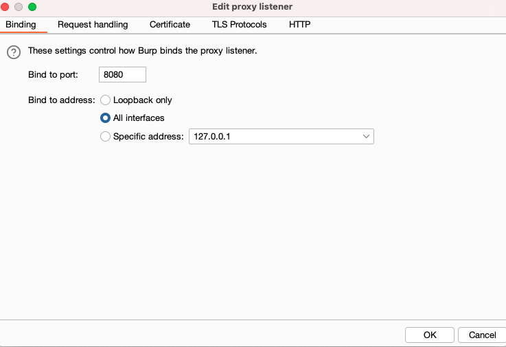
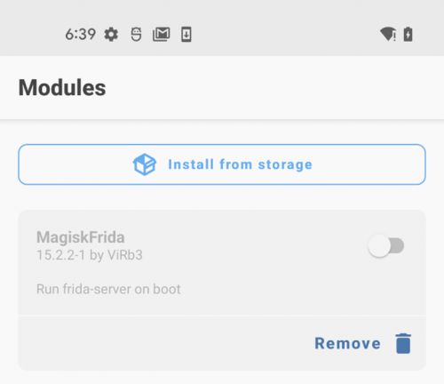

# AndroidBurpCertificate

# Prerequisites
To use this feature, it is necessary to have a rooted device with Magisk installed.

# Usage

The initial step is to configure Burp in the following manner.

execute the install.sh script.

# Install the module in Magisk

Prior to installing the module, it is necessary to activate Zygisk. Launch the Magisk app and click on the settings icon located at the top-right corner. Then, enable "Zygisk: run parts of Magisk in the zygote daemon:".

Reboot the phone.

Launch the Magisk application and go to Modules -> Install from storage:

After the installation reboot the device

# NOTE 

The source of this script is the subsequent blog: [link](https://www.blackhillsinfosec.com/start-to-finish-configuring-an-android-phone-for-pentesting/)

